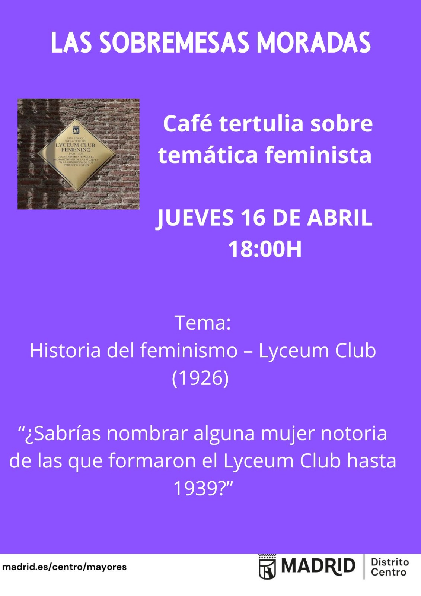

# Lyceum club (1926-1939) - Historia del Feminismo

**Sobremesas_Moradas** : Charlas - café sobre feminismo en al CMM Benito M. Lozano

## Agenda

- **Presentación de la iniciativa "Las sobremesas moradas"** y de sus dinamizadores - 5 minutos

- **Juego** : Identifica las profesiones de estas mujeres notorias que formaron parte del Lyceum club" - 15 minutos

- **Exposición**: ¿Qué fue el **Lyceum** club? ¿Quienes formaron parte? - 15 minutos

- **Charla en común** : opinando y debatiendo sobre la pregunta ¿ Conocemos a menos mujeres que a hombres notorias/os en los campos artísticos , académicos , profesionales o políticos a igualdad de méritos? Sí / No ¿ Por qué? - 45 minutos

- **Elegir próximos temas** - 5 minutos

- **¿Quieres incorporarte al equipo dinamizador?** - 5 minutos
  
  ---

## Presentación de la iniciativa "Las sobremesas moradas" y de sus dinamizadores

--> ir a [pagina principal de la Sobremesas Moradas](https://github.com/Jcspoza/CMMBML_Sobremesas_Modradas)

---

## **Juego** : Identifica las profesiones de estas mujeres notorias que formaron parte del Lyceum club

[Ficha / hoja de juego](./juego_lyceum_ok.pdf)

[Soluciones al Juego](Soluciones_juego_lyceum_ok.pdf)

**Contar puntos y proclamar ganador/a**

---

## Exposición: ¿Qué fue el **Lyceum** club? ¿Quienes formaron parte?

Video 1-  3 minutos: 

[Las primeras asociaciones El Lyceum Club Femenino. Plaza del Rey, 1 - YouTube](https://youtu.be/LfhZ4FxL2bs?si=Sv8TiFVTw_5_IveO)

Video 2 - 2 minutos

[Centenario del Lyceum Club Femenino: recuperar la memoria](https://www.rtve.es/play/videos/rtve-igualdad/centenario-del-lyceum-club-femenino-recuperar-memoria-mujeres/16987383/)

**Video 3 - 10 minutos** --> El mas adecuado para la charla

[LYCEUM CLUB FEMENINO. LA CASA DE LAS SIETE CHIMENEAS. - YouTube](https://youtu.be/JMggRWd3R7A?si=ENeJrEUajJy7CQ4r)

Video 2 - 16 minutos

[Lyceum Club - Trabajo academico](https://youtu.be/-tYO83KV7ws?si=SkMRTq4zuLn5SYGk)

--> Si quieres **ampliar la informacion sobre el Lyceum Club ,** descárgate [este fichero](LYCEUM_s_morada_ampliacion.pdf) elaborado por MA Rodriguez y JC Santamaria 

---

## Charla: ¿Tienen menos visibilidad las mujeres notorias?

O dicho de forma mas personal

* ¿**Conocemos a menos mujeres notorias** que a hombres notorios en los campos artísticos, académicos, profesionales o políticos **a igualdad de méritos**? Sí / No - > ¿ Por qué?

* ¿ Se **valoran menos** los méritos de las mujeres? SI/ NO -> ¿ Por qué?

* ¿ Hay **menos mujeres notorias** en algunos campos como la ciencia o el ajedrez, **por educación, historia o prejuicios**; o por ***diferentes*** capacidades ?

* .....

---

## **Elegir próximos temas**

### Propuestas de temas

- ¿Que es la **brecha salariar / en pensiones** y porque se produce?
- **Cuidados : diferencia de tiempos semanales empleados en cuidados no remunerados** entre  hombres y mujeres
- **Micromachismos**: concepto acuñado por Luis Bonino y si seguimos viendo/ haciendo/ sufriendo estos comportamientos
- **Mujeres en la republica**: mas allá de C. Campoamor y V. Kent
- [**Maria Telo**](https://es.wikipedia.org/wiki/Mar%C3%ADa_Telo) y el cambio legislativo de final del franquismo: ley [14/1975,](https://es.wikipedia.org/wiki/Ley_14/75_de_2_de_mayo_de_1975?action=edit&redlink=1) el fin de la subordinación legal al marido
- Las **cuotas** / las listas cremallera / los currículos ciegos : por que son necesarios aunque parecen discriminatorios
- **Réquiem por el piropo**

### Votación

---

## ¿Quieres incorporarte al equipo dinamizador
